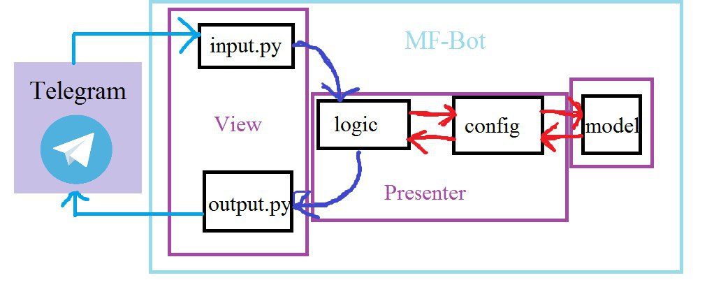

# Бот для Telegram-чата [MultiFandomRu](http://t.me/MultiFandomRu) и его ответвлений

Структура кода бота построена на основе шаблона проектирования MVC.
Советуеи изучить, к примеру по следующему материалу:

- [Паттерны разработки: 
MVC vs MVP vs MVVM vs MVI](https://habr.com/ru/post/344184/)
- [Паттерны для новичков:
 MVC vs MVP vs MVVM](https://habr.com/ru/post/215605/)
 
 (Можете предложить и другие в пункте
  [Issues](https://github.com/DeMaximilianster/MF-Bot/issues/new))
 

*Блок-схема, которая показывает структуру бота:*

  
 

